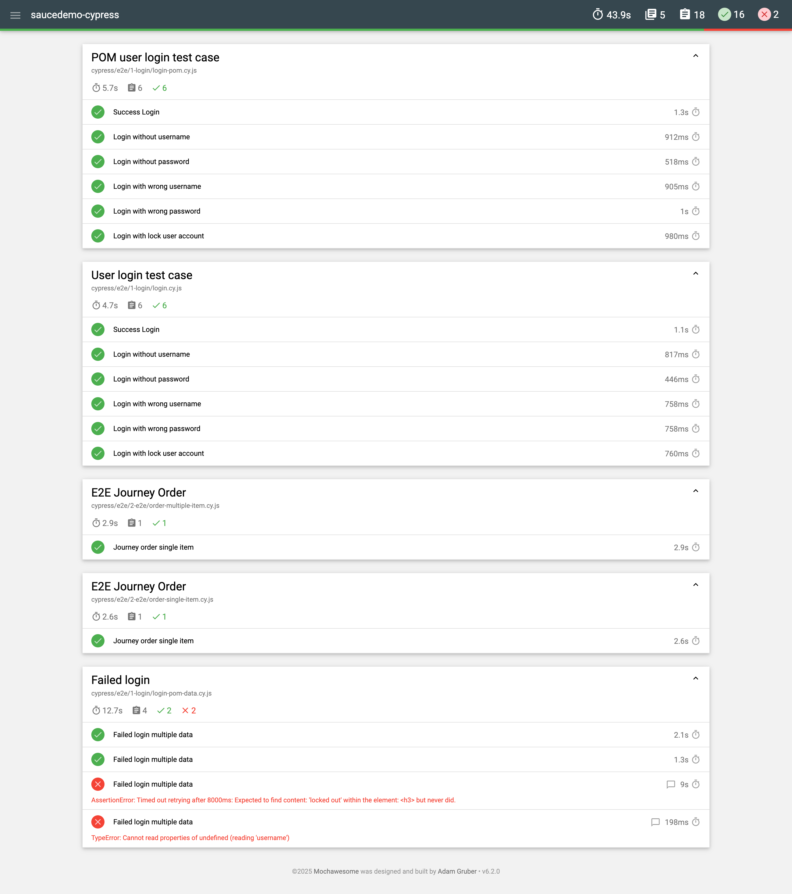
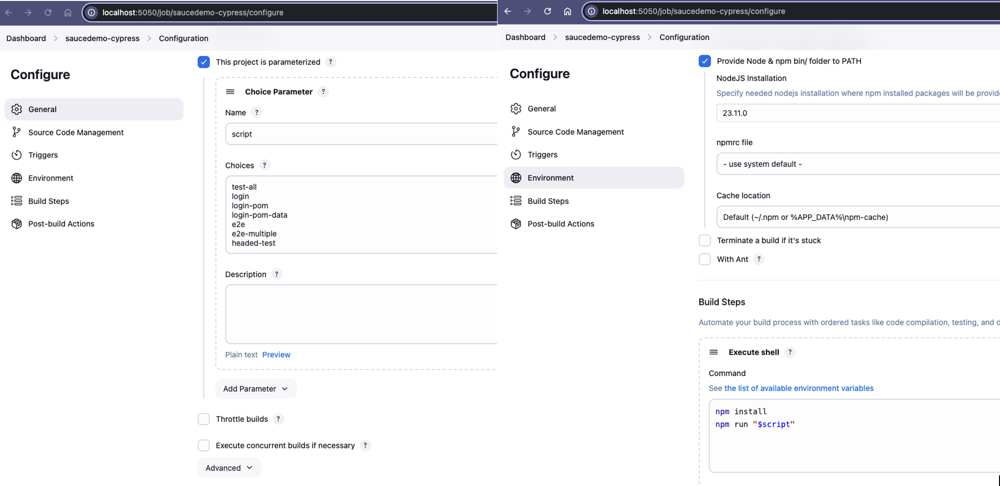
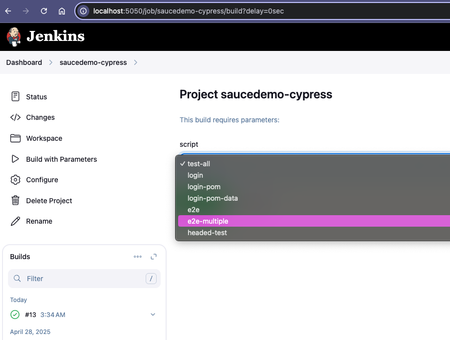
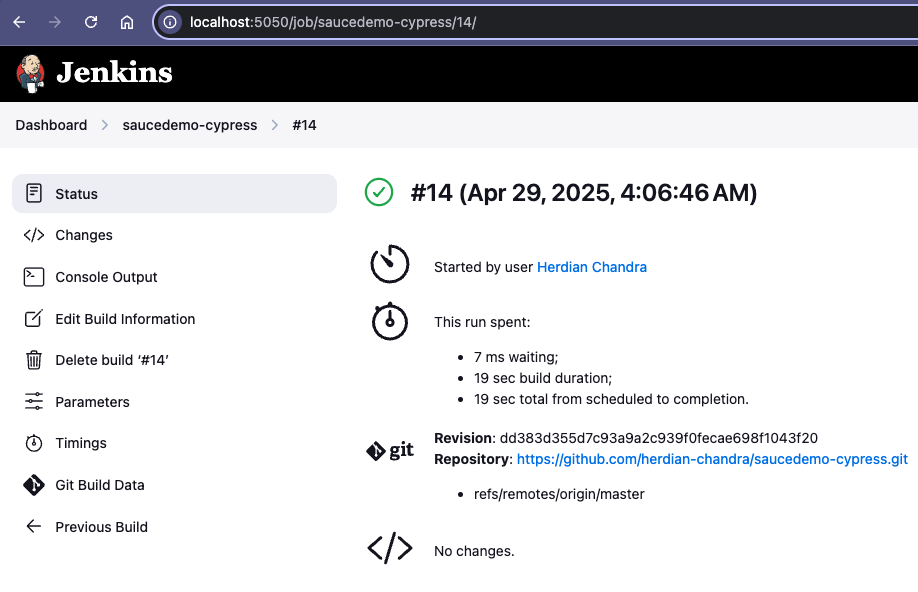
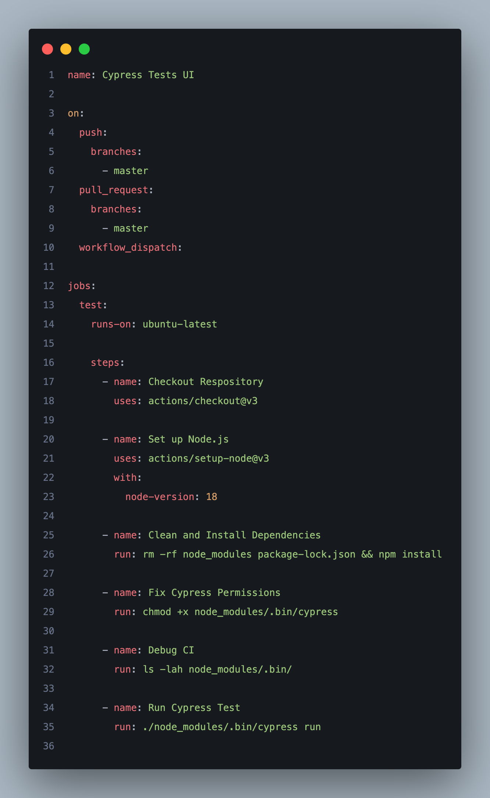
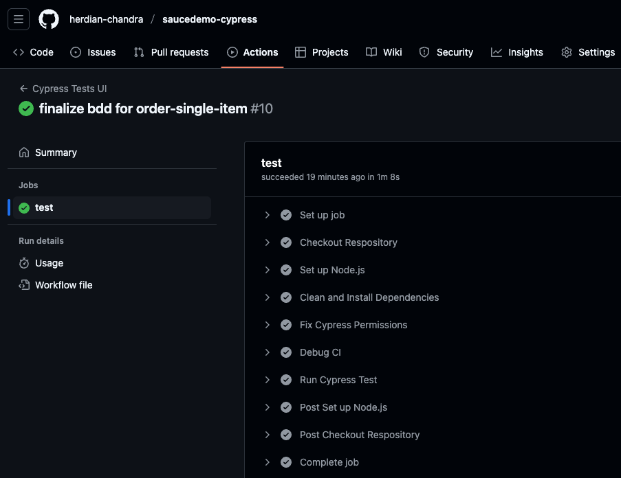

# saucedemo-cypress

[](https://skillicons.dev)

This repository contains a simple web automation project for SauceDemo, built using the Page Object Model (POM) design pattern.
It utilizes the fixture feature to load external test data, generates test reports with Mochawesome Reporter, and integrates with Jenkins CI/CD and Github Actions for automated job execution.

## Prerequisites

- Node.js and npm must be installed on your machine.

## How to run

Install project dependencies by running the following command in your terminal:

```sh
npm install
```

To open the Cypress Test Runner and view all test cases, execute:

```sh
npx cypress open
```

## Important Notes!

Currently this project has default project SpecPattern for .feature file for implementing BDD. you can check more details in **cypress/e2e/3-bdd**

## Sample Reports using Mochawesome



## Run in Jenkins

- This is a simple configuration job in jenkins

  

- Build with parameters

  

- Result

  

## Run in Github Actions

- This is a simple configuration job in github actions

  

- Result

  
