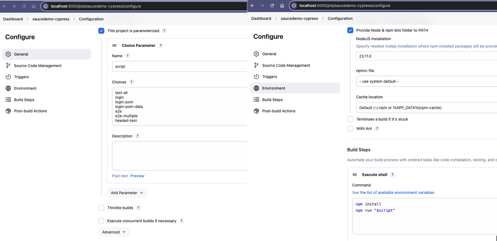
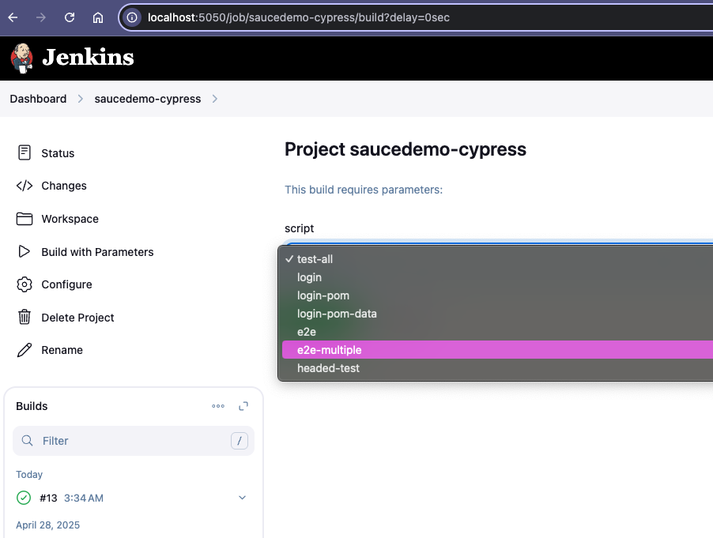
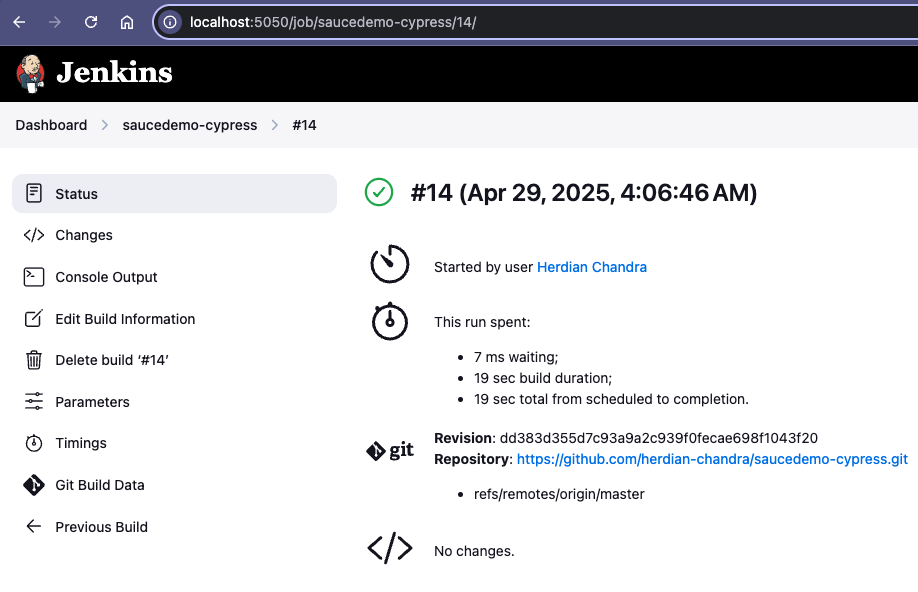

# saucedemo-cypress

This repository contains a simple web automation project for SauceDemo, built using the Page Object Model (POM) design pattern.
It utilizes the fixture feature to load external test data, generates test reports with Mochawesome Reporter, and integrates with Jenkins CI/CD for automated job execution.

## Prerequisites

- Node.js and npm must be installed on your machine.

## How to run

Install project dependencies by running the following command in your terminal:

```sh
npm install
```

To open the Cypress Test Runner and view all test cases, execute:

```sh
npx cypress open
```

Alternatively, you can refer to the `package.json` file to find and run specific test scripts tailored to different use cases.
| Scripts | Script Content |
| ------ | ------ |
| test-all | npx cypress run --browser chrome --spec cypress/e2e/ |
| login | npx cypress run --browser chrome --spec cypress/e2e/1-login/login.cy.js |
| login-pom | npx cypress run --browser chrome --spec cypress/e2e/1-login/login-pom.cy.js |
| login-pom-data | npx cypress run --browser chrome --spec cypress/e2e/1-login/login-pom-data.cy.js |
| e2e | npx cypress run --browser chrome --spec cypress/e2e/2-e2e/order-single-item.cy.js |
| e2e-multiple | npx cypress run --browser chrome --spec cypress/e2e/2-e2e/order-multiple-item.cy.js |
| headed-test | npx cypress run --headed --browser chrome |

## Run in Jenkins

This is a simple configuration job in jenkins

Build with parameters

Result

